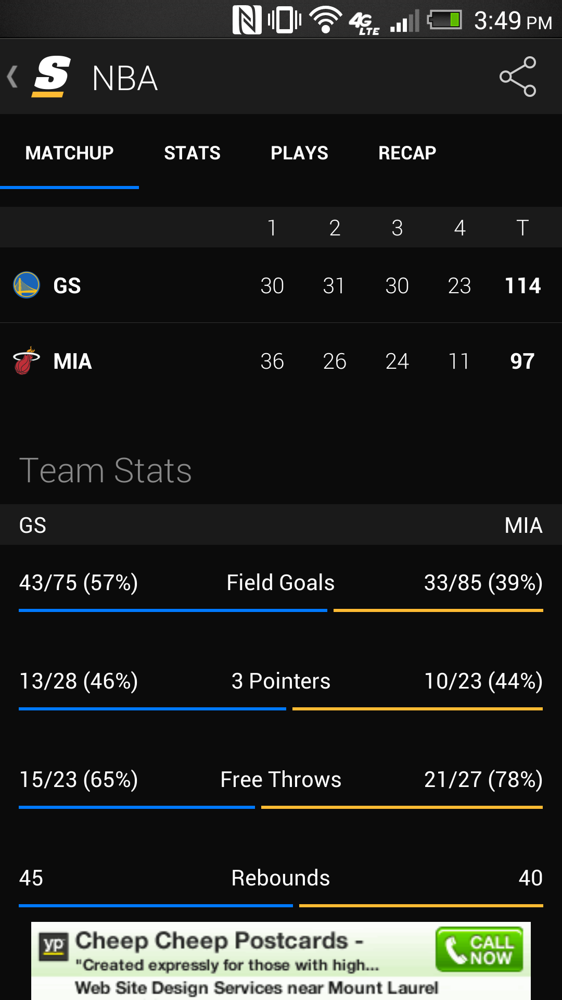

# BarWidget
#### A simple, configurable, reusable bar widget for use in Android applications.

BarWidget is a lightweight custom View for Android UI. Many applications use bars to display metrics, divide space between information, and add accents of color to their interface. BarWidget simplifies this process and provides basic animations that can make any page feel a little more alive.

Feel free to [check out a video of the demo app on Vimeo](https://vimeo.com/113106707).

To install the BarWidget demo application, you will need to have the Android SDK installed to use to the `adb` command. Then, simply attach an Android device to your computer and run:

    adb install -r BarWidget.apk

This will install and start the demo app, which contains some bars demonstrating a variety of their configuration options.

Here are some examples of apps that might benefit from an animated bar widget:

The balance-of-power on statistics in this basketball app:

The experience bars in the Google Play games app:

The points bar in the imgur app:

